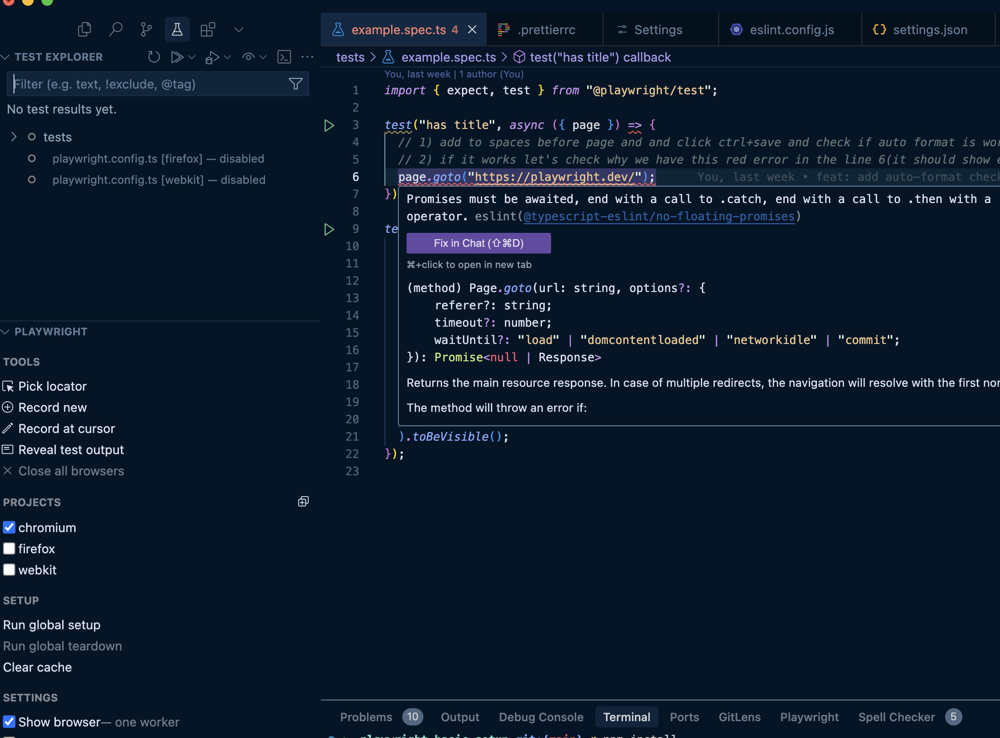

# Playwright basic setup

## Requirements

- installed node v22 and npm. I recommend using [NVM](https://github.com/nvm-sh/nvm) to manage node versions.

Clone this repo and execute:

```bash
npm install
```

Then install [VSC](https://code.visualstudio.com/) with recommended extensions and open this repository in it.
VSC recommended extensions

- ms-playwright.playwright
- dbaeumer.vscode-eslint
- pkief.material-icon-theme
- streetsidesoftware.code-spell-checker
- mattpocock.ts-error-translator

After installation your VSC testing tab should look like this:


To check if linter works properly open this file: tests/example.spec.ts

To check:

1. Auto format on save
2. Properly linting Playwright tests files
3. Running PW tests is possible.
4. Debugging PW tests in possible.
